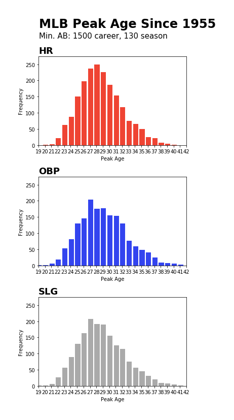

# MLB Peak Age Analysis

Confirm the finding that peak age of a major league hitter is 27. The Lahman Database has data for regular season batting. Peak output for home runs, on-base percentage and slugging percentage are used for measure of peak age. This analysis looks at hitters who played in 1955 through 2015.

## Output

## Usage

1. Clone this repo:

`$ git clone https://github.com/njpurcell/mlbPeakAge`

2. Get into the folder via `cd mlbPeakAge`.

3. Install requirements with either: 
	* `pip install requirements.txt` (be sure to use Python 3)
	* `conda install requirements.txt` (if using the anaconda distribution)

4. Run `python peakAgeGrapher.py`.
	* This will generate `mlbPeakAge.png`, which contains graphic shown above.

## Future Exploration

If you would like to extend this work, you might:
* Analyze the subset of Hall of Fame players to see if their peak ages differ from the general population of major leaguers
	* for this you could use `HallOfFame.csv` in the Lahman Database
* Go back further in time to explore changes in peak age over time to get a sense of how player development/training has changed
* Lahman Database can be downloaded here http://www.seanlahman.com/baseball-archive/statistics/
